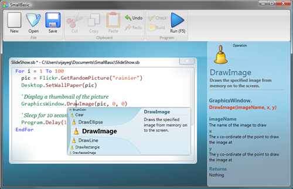
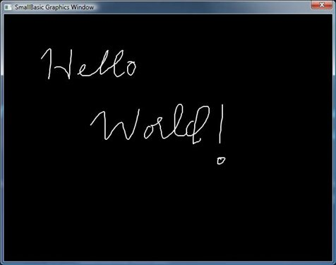

# Hello World

*Vijaye Raji &ndash; 23 October 2008 16:20*

Welcome to Small Basic Blogs! After being in part-time development for
nearly a year, Small Basic is finally out, and I'm excited to see where
this will go from here!




### History

It all happened in August of last year when someone sent me a pointer to
the article [Why Johnny Can't Code][1] and it got me thinking. After all,
when I was a kid, I started programming in [ZX Spectrum][2] with a built in
[Sinclair BASIC][3] interpreter and did so until I ran into [Turbo BASIC][4].
To me that transformation was groundbreaking and was the single most important
reason why I chose to write software for a living, for the rest of my life.

An informal poll along the corridors in Microsoft revealed that most developers
within Microsoft had started programming in some variant of BASIC. It had all
the good characteristics of a good beginner programming language &ndash; simplicity,
minimal ceremony, instant gratification and ubiquity. It helped them "get"
programming and assited them with understanding the need for more advanced
concepts.

When I asked them how they're going to teach programming to their children, they
were stumped. Almost everyone wanted to, they just didn't know how. Some said
[KPL][5], [Python][6], and [Ruby][7]. Some said [Alice][8] and [Scratch][9]. But
they all felt that none of these have the charm of BASIC. Of course there were
some that took the [Dijkstra's stand][10], but they were few.

[1]:    http://www.salon.com/tech/feature/2006/09/14/basic/
[2]:    http://en.wikipedia.org/wiki/ZX_Spectrum
[3]:    http://en.wikipedia.org/wiki/Sinclair_BASIC
[4]:    http://en.wikipedia.org/wiki/Turbo_Basic
[5]:    http://en.wikipedia.org/wiki/Kid%27s_Programming_Language
[6]:    http://en.wikipedia.org/wiki/Python_(programming_language)
[7]:    http://en.wikipedia.org/wiki/Ruby_(programming_language)
[8]:    http://en.wikipedia.org/wiki/Alice_(programming_language)
[9]:    http://en.wikipedia.org/wiki/Scratch_programming_language
[10]:   http://www.cs.utexas.edu/users/EWD/transcriptions/EWD08xx/EWD898.html

Of the numerous programming languages, BASIC, from its inception in the 1960s
has undergone some major transformations. Even among Microsoft's BASIC offerings,
the language and the environment (VS) has been repeatedly updated to include more
powerful features with every release. On the one hand this makes the language
and the environment very powerful and capable, but on the other hand, it makes it
daunting for a beginner.

That got me thinking as to why isn't there a "Small" variant of BASIC that brings
the simplicity of the original language to the modern day. And after a year, here
we are, announcing Small Basic. Small Basic is a project that will help make
programming easy and approachable for beginners. Now, that's a pretty big claim
&ndash; let's see how Small Basic does it.


### Make programming approachable

Small Basic starts with a really simple programming language that gathers
insporation from the original BASIC language. It has no more than 15 keywords
and is strictly imperative. There are no classes, scopes, generics, lambdas,
etc &ndash; just pure imperative code. The language is typeless and all variables
are dynamic and global all the time. The code gets compiled to IL and runs on
the .Net Framework.

It comes with a set of libraries that can be accessed from within a Small Basic
program. Since the language itself is .Net based, new libraries can be created
or the existing libraries modified using any .Net programming language.

Next, it combines the features of the language and the libraries into a very simple
and friendly programming environment. This environment gives beginners, access to
professional features like Intellisense(TM) and Instant context sensitive help. It
makes writing programs and executing them a breeze.


### Show me code already

Okay, here're a couple sample Small Basic programs


#### Sample 1: Change the desktop wallpaper from Flickr, every minute

```
While ("True")
  pic = Flickr.GetRandomPicture("fall leaves")
  Desktop.SetWallPaper(pic)
  
  Program.Delay(60 * 1000)
EndWhile
```


#### Sample 2: Makes a BlackBoard that allows you to scribble on a window

```
GraphicsWindow.BackgroundColor = "Black"
GraphicsWindow.PenColor = "White"
GraphicsWindow.MouseDown = OnMouseDown
GraphicsWindow.MouseMove = OnMouseMove

Sub OnMouseDown
  prevX = GraphicsWindow.MouseX
  prevY = GraphicsWindow.MouseY
EndSub

Sub OnMouseMove
  x = GraphicsWindow.MouseX
  y = GraphicsWindow.MouseY
  If (Mouse.IsLeftButtonDown) Then
    GraphicsWindow.DrawLine(prevX, prevY, x, y)
  EndIf
  prevX = x
  prevY = y
EndSub
```




### How can I get this?

You can download Small Basic today by visiting the [Small Basic portal][11]
or [Download page][12].

Also, don't forget to check out the [Getting Started Guide][13].

**Happy Programming!**

[11]:   http://smallbasic.com/
[12]:   http://social.technet.microsoft.com/wiki/contents/articles/30513.download-microsoft-small-basic.aspx
[13]:   http://download.microsoft.com/download/9/0/6/90616372-C4BF-4628-BC82-BD709635220D/Introducing%20Small%20Basic.pdf