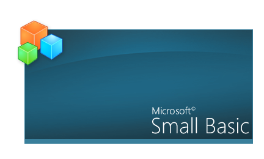

# The newest, leanest and the meanest is here!

*Vijaye Raji &ndash; 16 June 2009 13:59*

The next installment of the Small Basic Community Previews is now available
for download.



This version adds more of the community requested features and bug-fixes, the
full list of it is below:


### Arrays

Small Basic now has native support for arrays. Array keys are not limited to
numbers, and the arrays themselves can be multidimensional. An example is:

```
people[1]["Name"]["First"] = "Carl"
people[1]["Name"]["Last"] = "Fredrickson"
people[1]["Age"] = 78
```


### Unitialized Variables

The Compiler now catches and reports as error, any variable that isn't
initialized but is being used in the program. This makes it much easier to
catch misspelt variables.


### Spanish localization

The UI and API reference have been translated to Spanish, and is now available
alongisde English and French. The Guide will follow in a couple days.


### Environment Features

- **Find feature:** `Ctrl+F` brings up the new Find dialog. `F3` finds the next
  match.
- **Line and column indicator:** At the bottom right of the editor is a line and
  column indicator
- **Save As** command + toolbar button
- **Format Program** command: Available from the context menu in the editor, this
  command reformats the entire program with the right indentation.
- Mouse click and scroll support for Intellisense list box


### Under the hood

A new attribute `HideFromIntellisense` which hides deprecated operations and
properties from the Intellisense list.


### Others

- Tons of bug fixes
- Smaller footprint (installer is now just 3.7MB)
- Setup new auto-detects presence of .Net framework 3.5 SP1