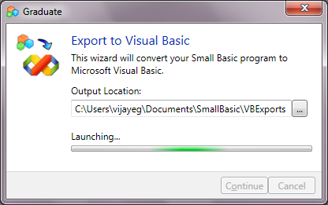

# Happy Birthday Small Basic

*Vijaye Raji &ndash; 23 October 2009 10:54*

Marking the first year anniversary since it went public, we're announcing
the 7th release of Small Basic CTP. This release adds localised support to
four new languages, extending Small Basic's reach to Chinese, French, German,
Italian, Korean, Russian, Spanish, and Turkish!

In addition, this release sports a cool new feature called "Graduate", that
allows you to port your Small Basic program seamlessly to Visual Basic.

In addition, this version also comes with the following much requested
features and bug-fixes:

1. A helpful crash reporting dialog that pops-up whenever your program
  crashes.
2. Fixes to Scrollbar size to make it easier to find in huge documents
3. Fixed crash when a specified image cannot be loaded
4. Fix for foreign keyboards not being able to use `AltGr`
5. Opacity and Visibility properties for Shapes
6. Make comments and objects more differentiated in syntax color