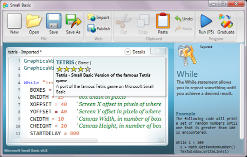
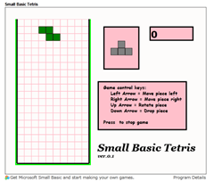

# Small Basic v0.8

*Vijaye Raji &ndash; 4 February 2010 19:33*

The eigth and newest installment of Small Basic is now available for
download!

This release features:

1. Addition of details about your published programs
2. Rating system for programs published online
3. Rich formatting based copy (useful for printing Small Basic programs)
4. Keyword help in Intellisense plus code samples.
5. Performance improvements in the Library APIs.

In addition, we have localized Small Basic in three new languages, Chinese
Traditional, Japanese, and Portuguese.

The coolest feature in this release is the Silverlight player for Small
Basic programs. Now you can run Small Basic programs on your browser without
having to install the IDE. You can even embed your programs/games on your
blog! As a sample, check out Tetris below!

[][1]

[1]: http://smallbasic.com/program/?TETRIS