# Small Basic 1.2 est arrivé: Support de Kinect et Correction de bug

*Yan Grenier &ndash; 3 October 2015 02:23*

La communauté Small Basic est fière de vous annoncer qu'une nouvelle version
de Small Basic: la version 1.2 avec le support de Kinect (V2 et Xbox One) 
ainsi que la correction de plusieurs bugs.

Microsoft Small Basic 1.2 inclus l'extension "Kinect for Small Basic", qui
ajoute trois nouveaux objets Kinect! Il améliore l'objet Dictionary pour
traduire dans 7 langues, corrige le bug de l'objet Dictionary, ainsi que 7
autres bugs et plantages. Il propose également une mise à jour des textes de
l'interface dans 15 langues! Si vous utilisez Windows XP ou un système 
d'exploitation plus ancien, veuillez télécharger le Small basic 1.0 à la
place.

Rappel: N'oubliez pas de désinstaller toute version précédente de Small Basic
avant d'installer cette nouvelle version. Si vous utilisez des extensions 
assurez vous qu'elles ont été recompilées pour la version 1.2 sinon elles 
ne fonctionneront pas.


### Installation sous Windows 10

Sous Windows 10 vous pouvez recevoir des alertes de sécurité au moment 
d'exécuter l'installation.

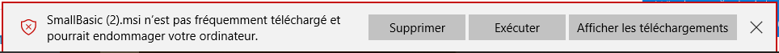

En lançant l'exécution vous pouvez avoir l'écran suivant vous protégeant
d'un risque potentiel :

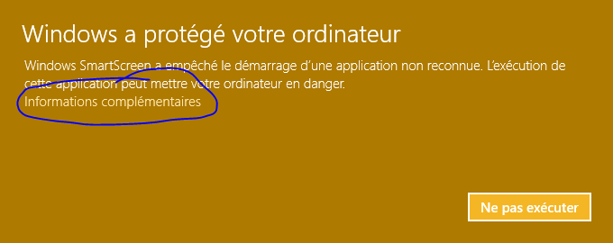

Cliquez sur "Informations complémentaires"

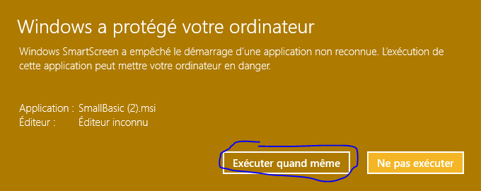

Cela fait apparaître le bouton "Exécuter quand même".


### Traduction de l'annonce officielle

L'annonce officielle a été faîte dans cet article : [./README.md](./README.md)

> Michael Scherotter est un Evangéliste de l'Expérience Media chez
> Microsoft qui travaille avec les sociétés de média pour les aider à
> construire leurs applications, il travaille avec les fabricants 
> d'imprimantes 3D pour les aider à écrire leurs drivers, et il est
> membre de l'équipe de développement du Small Basic qui fourni les
> objets Kinect au Small Basic 1.2.

Nous sommes heureux de vous annoncer qu'une nouvelle version de Small
Basic est maintenant disponible avec de nouveaux objets Kinect, 
amélioration des traductions, et correction de bugs. Si vous ne le savez
pas, Small Basic est un environnement de programmation BASIC gratuit de
Microsoft pour les enfants et qui fait partie de la famille des outils 
facile à utiliser pour programmer à destination des enfants qui inclus 
Kodu Game Lab et Touch Develop.


#### Kinect for Windows

Si vous utilisez Windows 8, Windows 8.1, ou Windows 10, et que vous avez
un capteur Kinect 2 ou un Capteur Kinect pour Xbox One branché à votre 
PC, vous verrez apparaître trois nouveaux objets disponibles dans Small
Basic: `KinectWindow`, `KinectBodyList` et `KinectFaceList`. Vous pouvez 
utiliser ces objets séparément, les uns avec les autres, ou avec n'importe
quel autre objet Small Basic. Imaginez les comme trois nouveaux objets que
vous pouvez programmer pour utiliser votre corps comme élément de contrôle
pour Small Basic. Chacun de ces nouveaux objets sont entièrement documenté
avec des exemples de code depuis la fenêtre de l'IntelliSense que vous 
pouvez copier/coller dans une fenêtre d'édition: 

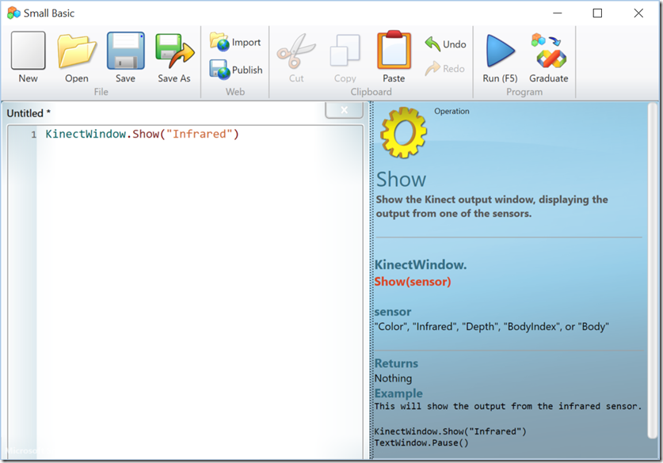


#### L'objet `KinectWindow`

L'objet `KinectWindow` est comme `GraphicsWindow` ou `TextWindow` dans le
sens ou il représente une fenêtre à l'écran. Sa principale fonction est de
vous montrer ce que les capteurs visuels de Kinect détectent.

- `KinectWindow.Show("Color")`  
  
  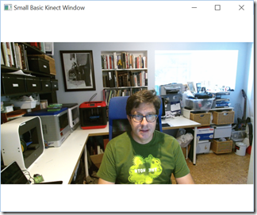
  
- `KinectWindow.Show("Depth")` 
  
  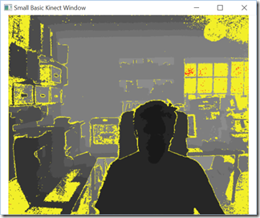
  
- `KinectWindow.Show("Infrared")` 
  
  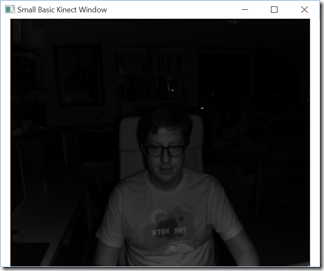
  
- `KinectWindow.Show("BodyIndex")` 
  
  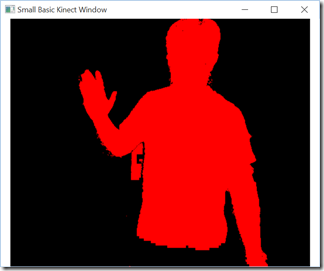
  
- `KinectWindow.Show("Body")` 
  
  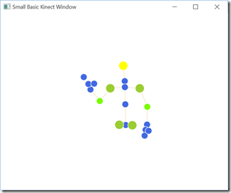
  
- `KinectWindow.Show("Color")`  
  `KinectWindow.IsBodySensor = "True"`  
  
  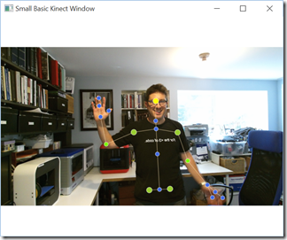

En plus de visualiser ce que les capteurs "voient", 
l'objet `KinectWindow` a également la capacité de supprimer le
fond et de placer les personnes par dessus d'autres images en temps
réel.

```
KinectWindow.IsBackgroundVisible = "False"
KinectWindow.BackgroundImage = "c:\temp\bridge.jpg"
KinectWindow.Show("Color")
```

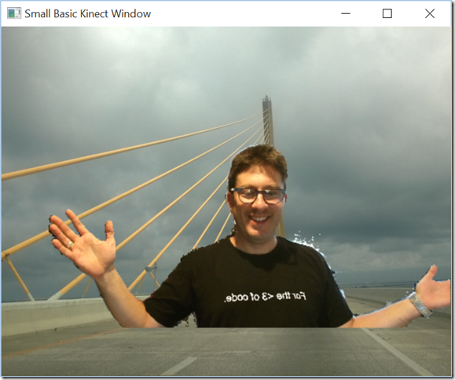

Il y a également des fonctions pour capturer une image depuis la
fenêtre Kinect (`KinectWindow.CaptureImage()`) ainsi qu'une image
recardée `KinectWindow.CaptureCroppedImage()`.


#### L'objet `KinectBodyList`

Utiliser l'objet `KinectBodyList` pour suivre la position et l'orientation
des corps jusqu'à 6 personnes (pas les chiens, j'ai essayé). Vous pouvez 
suivre la positions des "jointures" ("joint" en anglais) de l'ensemble des 
corps, des mains, aux chevilles et aux têtes. Vous obtenez la position dans 
un espace 3D en utilisant `KinectBodyList.GetJointOrientation()` et dans un
espace 2D à l'écran en utilisant using `KinectBodyList.GetJointScreenPosition()`.
En plus de la position des jointures, vous pouvez gérer l'état "ouvert/fermé"
de la main avec `KinectBodyList.GetHandState()` ainsi que l'épaisseur du 
corps `KinectBodyList.GetLean()`.


#### L'objet `KinectFaceList`

Utilisez l'objet `KinectFaceList` pour suivre l'orientation, l'expression
et la position jusqu'à 6 visages humains. Utilisez 
`KinectFaceList.GetFaceProperty()` pour obtenir l'aspect des visages comme
Happy (heureux), Engaged, WearingGlasses (port de lunettes), LeftEyeClosed
(œil gauche fermé), RightEyeClosed (œil droit fermé), MouthOpen (bouche
ouverte), MouthMoved (bouche fermée), ou LookingAway. En utilisant
`KinectFaceList.GetBoundingBoxInColorSpace()` avec 
`KinectWindow.CaptureCroppedImage()`, vous pouvez détecter où se trouvent
les visages dans une scène et extraire leur image pour les utiliser dans
votre programme Small Basic.


### Faîtes un Essai!

Nous sommes sûrs que vous allez penser à faire des choses cools avec Kinect
et le Small Basic, aussi nous avons essayé de vous permettre de commencer
aussi facilement que possible à programmer avec le capteur Kinect. Si vous 
avez déjà utilisé le capteur Kinect, vous vous rendrez certainement compte
que seulement une partie des capacités du capteur sont disponibles actuellement
dans Small Basic 1.2. Vous pouvez faire plus avec le [SDK 2.0 Kinect for Windows][1],
comme définir des gestes visuels et utiliser les microphones intégré
dans le capteur Kinect. Nous aimerions votre retour si vous avez des 
suggestions pour faire évoluer les nouveaux objets Kinect ou toute autre 
partie du Small Basic.

[1]: http://www.microsoft.com/en-us/download/details.aspx?id=44561

```
KinectWindow.Show("Color")
TextWindow.WriteLine("What does a code look like?")
TextWindow.Pause()
width = KinectWindow.SensorSize["Width"] / 4
height = KinectWindow.SensorSize["Height"] / 4
image = KinectWindow.CaptureImage(width, height)
GraphicsWindow.DrawImage(image, 0, 0)
```

Téléchargez Small Basic 1.2 maintenant!

Si vous voulez devenir un héro et commencer à enseigner le Small Basic
à des enfants, vous trouvez des tutoriaux, des cursus, la communauté et
des exemples [ici][2].

[2]: http://smallbasic.com/