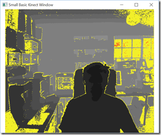
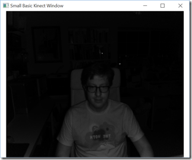

# Small Basic 1.2 Released with Kinect Support and Bug Fixes

*Michael Scherotter &ndash; 1 October 2015 13:46*

> *[Michael Scherotter](http://blogs.msdn.com/b/synergist/) is a Media
> Experience Evangelist at Microsoft who works with media companies to
> help them build apps, works with 3D printer manufacturers to help them
> write drivers, and is part of the Small Basic development team who
> brought Kinect objects to Small Basic 1.2.*

We are excited to announce that a new version of Small Basic is now
available with some cool new Kinect objects, language improvements, and
bug fixes. If you don't know, [Small Basic](http://smallbasic.com/) is
Microsoft's free BASIC programming environment for kids and is part of
a family of easy-to-use free coding tools for kids that includes [Kodu
Game Lab](http://www.kodugamelab.com/) and 
[Touch Develop](https://www.touchdevelop.com/).


### Kinect for Windows

If you are running Windows 8, Windows 8.1, or Windows 10, and have a
Kinect 2 Sensor or [Kinect for Xbox One Sensor](http://aka.ms/k4wv2purchase)
attached to your PC, you will see three new objects available to you
in Small Basic: `KinectWindow`, `KinectBodyList` and `KinectFaceList`. You
can use these objects separately, with each other, or with any of the
other Small Basic objects. Think of them as three new objects to program with
that enable your body to become an input device for Small Basic. Each of the
new objects are fully documented with code samples in the Intellisense window
that you can copy/paste to the code window:


#### `KinectWindow` Object

`KinectWindow` is like `GraphicsWindow` or `TextWindow` in that it represents
a window on the screen. It's main use is to let you see what the visual sensors
in the Kinect are detecting.

- `KinectWindow.Show("Color")`  
  
  
  
- `KinectWindow.Show("Depth")` 
  
  
  
- `KinectWindow.Show("Infrared")` 
  
  
  
- `KinectWindow.Show("BodyIndex")` 
  
  
  
- `KinectWindow.Show("Body")` 
  
  
  
- `KinectWindow.Show("Color")`  
  `KinectWindow.IsBodySensor = "True"`  
  
  
  
In addition to visualizing what the sensors "see", the `KinectWindow` object also
has the ability to remove the background and place people in front of other images
in real time.

```
KinectWindow.IsBackgroundVisible = "False"
KinectWindow.BackgroundImage = "c:\temp\bridge.jpg"
KinectWindow.Show("Color")
```


There are even functios to capture an image from the `KinectWindow`
(`KinectWindow.CaptureImage()`) and a cropped image (`KinectWindow.CaptureCroppedImage()`).


#### `KinectBodyList` Object

Use the `KinectBodyList` to track the position and orientation of the bodies of up to
6 people (not dogs, I've tried). You can track the position of "joints" throughout the
bodies being tracked, from the hands, to ankles, to heads. You get the position in 3D
space using `KinectBodyList.GetJointOrientation()` and in 2D space on the screen using
`KinectBodyList.GetJointScreenPosition()`. In addition to joint positions, you can hand
open/closed state with `KinectBodyList.GetHandState()` and the lean of the body using
`KinectBodyList.GetLean()`.


### `KinectFaceList` Object

Use the `KinectFaceList` object to track the orientation, expression, and position of
up to 6 human faces. You use `KinectFaceList.GetFaceProperty()` to get aspects of faces
like *Happy*, *Engaged*, *WearingGlasses*, *LeftEyeClosed*, *RightEyeClosed*, *MouthOpen*,
*MouthMoved*, or *LookingAway*. Using the `KinectFaceList.GetBoundingBoxInColorSpace()` in
conjunction with `KinectWindow.CaptureCroppedImage()`, you can detect where faces are in
the scene and grab their images to use in your Small Basic program.


### Give It a Try!

We're sure that you will think of something cool to do with Kinect and Small Basic as we've
tried to make it as easy as possible to start programming with a Kinect sensor. If you have
used the Kinect sensor already, you will probably realizer that only a portion of its
capabilities are exposed today in Small Basic 1.2. You can do even more with the [Kinect
for Windows SDK 2.0](http://www.microsoft.com/en-us/download/details.aspx?id=44561), like
define visual gestures and use microphones built into the Kinect sensor. We would love
your input if you have any suggestions for enhancing the new Kinect objects or any other
part of Small Basic.

```
KinectWindow.Show("Color")
TextWindow.WriteLine("What does a code look like?")
TextWindow.Pause()
width = KinectWindow.SensorSize["Width"] / 4
height = KinectWindow.SensorSize["Height"] / 4
image = KinectWindow.CaptureImage(width, height)
GraphicsWindow.DrawImage(image, 0, 0)
```

If you want to be a hero and start teaching Small Basic to kids, you can find tutorials,
curriculum, community, and samples [here](http://smallbasic.com/).

> *In addition to this blog post, a set of release notes were made available. These
> can be found in this repository in the [NOTES.md](./NOTES.md) file.*